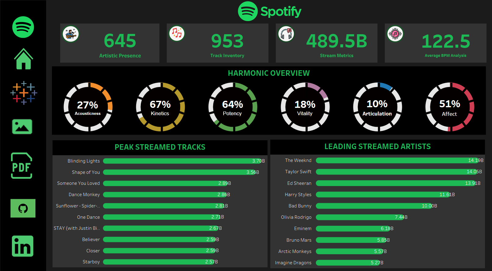

# Spotify Insights

## Overview

Spotify Insights is a Tableau-based analytics project focused on exploring musical trends, streaming performance, and audio characteristics from Spotify data. The workbook combines multiple dashboard views to present a holistic look at song popularity, metrics, and platform-wide patterns.

## Dashboard Preview

## Tableau Public Dashboard

View the published dashboard here:

https://public.tableau.com/views/Spotify-Insights_17774065946430/SpotifyDashboard-HolisticMusicalInsights?:language=en-GB&publish=yes&:sid=&:redirect=auth&:display_count=n&:origin=viz_share_link

## Repository Contents

- `src/Spotify-Insights.twbx` - Tableau packaged workbook containing the project dashboards.
- `assets/` - Dashboard preview images used for documentation.
- `data/` - Source datasets and supporting reference files.

## Data Sources

The project includes the following data files in the `data/` directory:

- `Onyx Data DataDNA Datatset Challenge - Spotify Most Streamed Songs 2023 Dataset - October 2023.xlsx`
- `data-dictionary.xlsx`

## How to Use

1. Open `src/Spotify-Insights.twbx` in Tableau Desktop or Tableau Reader.
2. Review the dashboards to explore streaming and audio insights.
3. Use the Tableau Public link above to view the published version online.

## Notes

This repository is primarily intended for analysis and visualization. If you update the workbook or add new dashboard exports, keep the image in `assets/` and the Tableau link in sync with the latest published version.